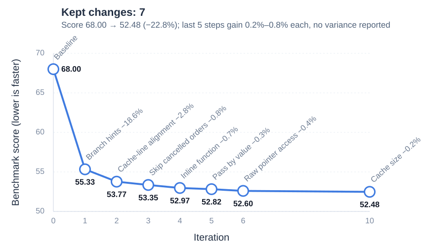

# How to Reliably Evaluate Agent-Generated Performance Optimizations

**Research overview** · Junming Liang, Anhui Normal University · July 2026 – present

📄 [Research overview (PDF, 3 pages)](research_overview.pdf) · [Earlier technical report v0.1 (PDF, 9 pages)](paper_v01.pdf)

This repository holds my ongoing research on when a performance patch proposed by a coding agent can be accepted. The overview below describes the current evaluation pipeline and a real case; the earlier technical report and its frozen, reproducible artifact are documented further down.

## 1. Background and Problem

**Application.** The core programs of quantitative trading systems—market-data handling, factor computation, order and position processing—are mostly written in C++ or Rust and are highly sensitive to latency and throughput; engineers routinely iterate for gains of a few percent. They must also be strictly correct: a subtle change in logic can directly affect orders and positions, while existing tests usually cover only typical inputs, so passing them does not mean nothing is broken. Optimization here means being faster without being wrong.

**Workflow.** I carry out such optimizations with multiple coding agents: a profiler such as `perf` locates the hotspots; an agent, given the hotspot, the relevant code and the input/output requirements, proposes a candidate patch; and the patch is compiled, checked, measured, and then kept, repaired or discarded. Agents can propose many candidates in a short time, so the bottleneck becomes the decision: is a patch a genuine improvement, and is it worth accepting?

**Why this decision is hard.** Low-latency developers I talk with agree that optimization presupposes an accurate evaluation standard, and that this standard is the hardest part to build:

- **Measurements are noisy.** On my workload, repeated runs of the same program on the same machine vary with a standard deviation of 7–10% of the mean without CPU pinning (about 5% with pinning on the same day), while many optimizations gain only a few percent. Environment isolation—CPU pinning, process isolation, real-time scheduling—reduces the noise, and production machines for low-latency trading are typically configured this way; shared cloud and CI environments often cannot be isolated. Either way, the noise does not disappear.
- **Estimates can be biased**, wrong in one direction however many runs are made. A candidate that always runs after the baseline may benefit from warm caches; concurrent and sequential runs can give different gains; and a test environment unlike production can mislead. Selection adds more: among 20 useless patches, one or two will look faster by chance, and stopping at the first significant result pushes the error rate far above the nominal 5%.
- **The budget is limited.** Every extra minute spent on one candidate is a minute not spent on another; the more candidates, the sharper this trade-off.

**Research question.** *When the evaluation budget is limited, what evidence is sufficient to accept an agent-generated performance optimization?* The problem is not unique to my work. [auto_optimization](https://github.com/zjusharkyu/auto_optimization), a public project inspired by Karpathy's autoresearch, lets an agent optimize an order-book program, keeping any change that measures faster than the current best and passes the tests. Five of the seven changes it kept gained only 0.2–0.8% each; its benchmark script configures environment isolation, but no measurement variability is reported, so the records alone cannot confirm these small gains (Figure 1). [Chen et al. (2026)](https://arxiv.org/abs/2607.01211) found that many official reference patches in published agent performance benchmarks, replayed on other machines, do not consistently meet the benchmarks' own validity criteria.



**Figure 1.** The public auto_optimization loop. A change is kept if it beats the current best and passes 14 unit tests; in 30 minutes the agent ran 20 iterations and kept 7, discarding the rest (slower, failed builds or crashes). The benchmark script configures CPU pinning, process isolation and real-time scheduling; each point is the median of 40 runs. Score: mean time for a batch of about 36,000 order messages, in units of 10 µs.

**Goal.** I treat the two risks differently. **Correctness is an absolute veto:** a candidate that fails any check is rejected or sent back for repair, and speed never buys it back. **Performance is a statistical judgment:** control how often changes without real benefit are accepted, attach an uncertainty to real gains, and treat "not confirmed within this budget" as an explicit outcome.

## 2. The Evaluation Pipeline

An implementation agent proposes and repairs patches, another agent reviews the code and evidence, and scripts run the checks and measurements and issue verdicts under frozen rules. An agent judging its own patch would be grading its own work, so rules are fixed in advance and all raw records are kept for independent recomputation; patch hashes are verified before every run, so nothing stale slips in.

**Step 1: Correctness first.** On the test workload, the candidate's final program state must match the original's exactly. Because the workload holds only typical inputs, I also (1) write an *input contract* stating which inputs must be handled correctly and how malformed input is treated; (2) run differential tests on boundary and malformed inputs against the original program, judging inputs on which the original's behavior is undefined by the contract; (3) run ASan and UBSan; and (4) have an agent other than the proposer review the patch and the compiler warnings. A failing patch is rejected or sent back however fast it is; a repaired patch is re-checked and re-measured as a new candidate.

**Step 2: Is the speedup real and large enough?**

- **Paired, windowed measurement.** The original and the candidate run back to back as a pair, in random order, and each pair's time difference is one measurement. Consecutive pairs form windows in which both orders appear equally often, to balance run-order effects within each window; the example's confirmation used 10 windows of 58 pairs, sized from the time budget and per-pair cost.
- **Window-level interval.** A 95% t-interval is computed from the window means (assumed approximately independent), because noise drifts over time and treating hundreds of pairs as independent would overstate confidence.
- **Two-level conclusion.** An interval wholly above zero shows a gain; wholly above a pre-set minimum effect (1% of the original's time by default, adjustable in advance), the gain is worth keeping. Two cross-checks, the plain mean and the number of pairs won, must agree or be explained.

**Step 3: Prevent biased estimates.**

- **Run order** is randomized and balanced; in one batch, order alone shifted the gain by about 57 ms.
- **The measurement environment follows deployment.** Some gains depend on the environment—a change that reduces cache misses may gain differently on a dedicated core than on a shared one—and in the wrong environment more runs only measure the wrong thing more precisely. So measurement is pinned and isolated if production is, and runs under the same shared conditions if the program is deployed on cloud or CI machines.
- **Selection.** Candidates that pass exploration tend to be the lucky ones, so exploration only selects; the verdict uses fresh confirmation data alone.
- **Analysis flexibility.** The metric, the threshold and the sample size are fixed before measurement, with no changes or early stopping afterwards.

**Step 4: Decide within a budget.** Each candidate gets a fixed time—about 10 minutes of exploration and 30 of confirmation—and only those whose exploration estimate reaches the minimum effect go on to confirmation. The detection capability is estimated during planning: in the example, a change of about 1.5–2% is estimated to have roughly an 80% chance of being detected (interval above zero); a smaller true gain will likely end as "not confirmed within this budget" rather than trigger open-ended re-measurement. Every verdict reports its machine time.

## 3. Evidence: A Real Optimization

**Outcome.** The example is a public C++ limit-order-book program that simulates an exchange's order book and matching engine; the test workload is 600,000 order instructions (new orders, cancels, modifications, market orders, etc.). The agent's patch replaced heavyweight C++ stream parsing and formatting with `std::from_chars` and `std::to_chars`. **The verdict was accept:** the mean time to process all instructions fell from 1.83 s to 1.28 s, **a 30.0% reduction** (550.6 ms; 95% confidence interval 527.4–573.7 ms), and the program state at the end of every timed run matched the original's. This is the time for the whole batch, not per-order latency.

**How it was reached.**

1. **The first version was rejected.** It passed the workload check and measured faster, but the reviewing agent found three defects the workload never exercises: it dropped inputs the original accepts (e.g., leading spaces), it could read uninitialized values on malformed lines, and its output buffer relied on an unstated capacity assumption, exposed by a compiler warning.
2. **The repaired version passed** 28 differential test cases, including leading spaces, numeric boundaries and malformed input, and the sanitizers found no problem introduced by the patch.
3. **It was re-measured as a new candidate.** Exploration (192 pairs) estimated a gain of about 566 ms, above the 1% threshold; confirmation (580 fresh pairs) gave the result above, with the interval's lower bound far above the threshold (18.3 ms). Both cross-checks agreed; the candidate was faster in 577 of 580 pairs. The two stages took about 43 minutes of machine time, including builds and checks, within the pre-set limits.

## 4. Contributions and Next Steps

**Contributions.** I designed and implemented a pipeline for evaluating agent-generated optimizations in which correctness is an absolute veto and performance must be confirmed with fresh data within a pre-declared budget. There are only three outcomes—accept, reject (or send back for repair), and not confirmed within this budget—each reported with its cost. In the real case above, checks plus timing alone would have accepted a defective patch; independent review stopped it, the input problems it found became differential tests, and a substantial runtime reduction remained after repair and fresh confirmation. The statistical methods are established; what I care about is how evidence should be gathered, and verdicts made, when agents generate candidates at scale.

**Open questions and next steps.**

- **Correctness.** Whether the checks are complete is untested. Next: fuzz the differential-test inputs, and inject known bugs to measure missed bugs and wrongly rejected valid patches.
- **False acceptance.** How often the pipeline accepts a change with no real benefit is untested. Next: count how often comment-only patches that leave the compiled result unchanged are judged faster.
- **Budget.** A 30% gain is far above the 1.5–2% this budget can resolve, so the budget went untested. Next: slow the program by a known 1–5% to find the smallest gain a given budget confirms, on pinned machines and in cloud and CI.
- **Bias.** A first comparison with concurrent runs was inconclusive, and other days are untested. Next: repeat confirmation across days and with concurrent runs; when several candidates compete, confirm the winner on fresh data, with a threshold that tightens as their number grows.

Longer term, I want to study whether feeding this evidence back to the agents improves their patches.

---

## Earlier technical report (v0.1): Selective Authorization of Automated Performance Patches

**Rule Audit and Case Study of a Frozen Promotion Gate**
Junming Liang, Anhui Normal University — Technical Report v0.1, September 2026

📄 **[Read the paper (PDF, 9 pages)](paper_v01.pdf)**

---

### What this is

Coding agents can propose performance patches faster than noisy hardware can
validate them. That creates an authorization problem distinct from patch
generation: *when is the evidence strong enough to permit automatic promotion?*

This report takes one **frozen** promotion gate — a paired-measurement rule
combining a minimum practical effect, a bootstrap confidence interval, a paired
permutation test, a sign-consistency threshold, and a bounded 4/8/12 sample
ladder — and does two things with it:

1. **Audits the rule.** What can this decision procedure actually certify, and
   what does it only appear to certify?
2. **Runs a preregistered public case study.** How does it behave on fmt 12.1.0
   under 30 strict A/A nulls and one real candidate?

The gate was frozen *before* the study. The audit does not propose a
replacement policy.

### Main findings

**The sample budget cannot support the sign threshold as a confidence claim.**
The gate requires sign consistency ≥ 0.9. If that is read as a claim about an
underlying probability *q*, then under an IID Bernoulli-sign model, rejecting
`q ≤ 0.9` at one-sided 5% significance needs **at least n = 29 observations**,
and at that minimum **every one of the 29 paired differences must be positive**
(since `0.9^28 = 0.05233 > 0.05 ≥ 0.9^29 = 0.04710`). The frozen ladder stops at
12. The threshold is therefore usable as a heuristic filter, not as a
95%-confidence statement.

**Arm order is not identifiable.** Odd pair indices always ran the candidate
first and even indices always ran the control first; 0 of 244 null pairs
violated this mapping. Arm order is therefore perfectly confounded with
pair-index parity, and an arm-order effect cannot be estimated.

**The gate promoted 0 of 30 strict A/A nulls** (one-sided 95% upper bound
9.503%, *under an independent common-probability Bernoulli model*), where a
deliberately weak first-pair counterfactual would have accepted 16 of 30.
**This must be read together with the fact that all null candidate and control
binaries were byte-identical and shared one hash.** The result calibrates the
end-to-end pipeline on strict A/A inputs; it says nothing about sensitivity to
binary-distinct but semantically equivalent patches.

**The one real candidate was not auto-promoted.** A buffer-reuse change showed
a median paired gain of 35.861 ms (6.515%) but ended as
`accepted_noisy_single` — an evidence-only verdict requiring independent
replication, because 7 of 8 pairs were positive (0.875) against a 0.9 sign
threshold.

### What this does *not* claim

- No universal false-promotion rate for automated performance gates.
- No claim that this gate is better than any alternative.
- No cross-system generality: one target, one host, one frozen configuration.
- No power estimate — there is exactly one real candidate.
- The next-stage simulation contract referenced in §8 is **unexecuted**; all
  related policy comparisons are prospective.

### Reproducing the numbers

Every number in the paper is emitted by a script that reads only the public
artifact — it never touches raw execution evidence:

```bash
python paper_numbers/reproduce.py
```

Expected: `RESULT: all claims reproduced` (86 checks, exit 0). Requires Python
3.9+, standard library only.

Regenerate the three figures:

```bash
python paper_numbers/figures.py
```

Rebuild the PDF (needs a LaTeX distribution):

```bash
cd paper_v01/source && pdflatex main && bibtex main && pdflatex main && pdflatex main
```

### Repository layout

| Path | Contents |
|---|---|
| `paper_v01.pdf` | the paper |
| `paper_v01/source/` | LaTeX source and bibliography |
| `paper_numbers/` | number reproducer, figure generator, vector figures |
| `harness/` | curated subset of the generation-and-timing side (see Scope of harness/) |
| `v2_fmt_public_formal_experiment/publication_v2/` | the frozen public artifact |

The artifact contains typed pair-level evidence for all 31 candidates
(`candidate_evidence.jsonl`), the extracted frozen judge (`frozen_judge_v1.py`),
fixed differential cases, custody and inventory hashes, a self-contained
recomputer (`recompute_public.py`), and an external-consumer acceptance record.
See `publication_v2/README.md` for its own manifest.

### Scope of harness/

`harness/` is the side that produces and times candidate patches; the paper
audits the **decision** side. This is a curated subset, not the full loop —
the execution scripts that drive the measured binaries are intentionally
excluded, so this code demonstrates the design but **does not run
end-to-end**.

### Provenance

AI coding assistants supported repository implementation, evidence checking,
and manuscript drafting. The public package does not retain
candidate-by-candidate model attribution, so this report does not claim that every fmt
candidate was agent-generated. The author defined and froze the protocol,
authorized execution, interpreted the evidence, and is responsible for every
claim. No model-generated number is treated as evidence — values were accepted
only when reproduced by the deterministic recomputer. Full statement in §9 of
the paper.

### Status

Technical report, not peer reviewed. Corrections and replication attempts are
welcome via issues.

### Version history

- v0.1.1 (tag): initial public release (frozen artifact + paper + number
  reproducer).
- Latest (post-v0.1.1): Threats to Validity now quantifies the arm-order
  confound — candidate-first minus control-first over the pooled 244 null
  pairs is 5.373 ms in means and 4.733 ms in medians, about 1.972x the median
  practical-effect threshold the gate applies; the text states plainly that
  the contrast cannot be attributed to arm order, to position within a run,
  or to any other time-varying cause. Pervasive noise flagging (all 31
  candidates `NOISY`) is reported without attributing the dispersion to any
  source. The number reproducer adds the five A10b checks for these values.
  The PDF is rebuilt from the same LaTeX source with a deterministic build
  (`SOURCE_DATE_EPOCH` + `\pdftrailerid{}`). The hash reproduces on the
  same TeX distribution; a different distribution yields different bytes.
  SHA-256 of the published build:
  SHA-256: `DC243D91CE661171689A4D8D54C9452CA0AC8C713235E7FC5EB5D3E55DE0B364`.

### Licensing

This repository uses file-specific licenses; see [LICENSE](LICENSE) for the
complete scope. The four reproduction/judge Python scripts are MIT-licensed,
and the listed JSON/JSONL evidence files are CC BY 4.0. The paper, bibliography,
README files, narrative reports and three committed figure PDFs remain all
rights reserved. The figure-generation code is MIT even though the separate
committed figure PDFs are reserved. These notices do not alter any bytes in
the frozen public artifact.
